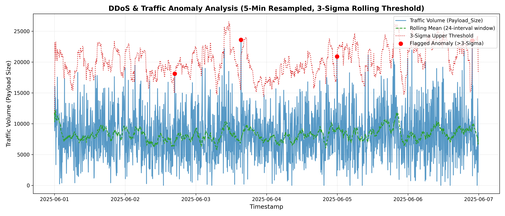

# Activity 1: Case-Based Learning Activity — DDoS Attack Prediction using Time Series Analysis

## Executive Summary
This document fulfills the requirements for **CA1 (Activity 1)**: Case-Based Learning Activity on **DDoS Attack Prediction using Time Series Analysis**. The analysis uses the Kaggle **Intrusion Detection Logs (Normal, Bot, Scan)** time-series dataset to analyze time-based network traffic patterns, detect abnormal volumetric traffic spikes via rolling 3-sigma thresholding, evaluate detection performance against ground-truth attack labels, and propose cybersecurity mitigation strategies.

---

## 1. Problem Statement
Modern enterprise infrastructure is continuously targeted by volumetric Distributed Denial of Service (DDoS), Botnet sweeps, and Reconnaissance Port Scans. Static detection rules often fail against stealthy or evolving attack profiles. Applying **Time Series Analysis** on aggregated network logs allows security operations centers (SOC) to establish a dynamic baseline of normal traffic behavior and flag statistically significant anomalies (> 3 standard deviations above the rolling mean) in real time.

---

## 2. Step 1: Real Data Inspection

The target dataset file [`Time-Series_Network_logs.csv`](file:///c:/Users/DELL/OneDrive/Desktop/mlcs%20lab/Time-Series_Network_logs.csv) was inspected directly before modifying the script.

### Data Preview (`df.head()`)
```text
             Timestamp        Source_IP Destination_IP  Port Request_Type Protocol  Payload_Size                                         User_Agent   Status  Intrusion Scan_Type
0  2025-06-06 06:04:08   192.168.54.167  42.156.67.167    80         SMTP      UDP           900  Mozilla/5.0 (Windows NT 10.0; Win64; x64) ...  Success          0    Normal
1  2025-06-04 15:20:59  192.168.193.254  94.60.242.119   135       Telnet      TCP           120  Mozilla/5.0 (Windows NT 10.0; Win64; x64) ...  Failure          0    Normal
2  2025-06-03 07:23:49    192.168.91.17     7.10.192.3    21          DNS      TCP          1850  Mozilla/5.0 (Windows NT 10.0; Win64; x64) ...  Success          0    Normal
3  2025-06-03 11:35:42   192.168.108.75    8.8.174.150   443         HTTP      UDP          1400  Mozilla/5.0 (Windows NT 10.0; Win64; x64) ...  Success          0    Normal
4  2025-06-05 06:09:02  192.168.245.254    1.1.135.210    80        HTTPS      TCP          1100  Mozilla/5.0 (Windows NT 10.0; Win64; x64) ...  Success          0    Normal
```

### Data Schema (`df.columns.tolist()` & `df.dtypes`)
- **Columns**: `['Timestamp', 'Source_IP', 'Destination_IP', 'Port', 'Request_Type', 'Protocol', 'Payload_Size', 'User_Agent', 'Status', 'Intrusion', 'Scan_Type']`
- **Data Types**:
  - `Timestamp`: `object` (converted to datetime)
  - `Payload_Size`: `int64`
  - `Intrusion`: `int64`
  - `Scan_Type`: `object`

### Label Distribution (`df['Scan_Type'].value_counts()`)
```text
Scan_Type
Normal       8000
BotAttack     514
PortScan      352
Name: count, dtype: int64
```

---

## 3. Step 2: Script Configuration (`ddos_timeseries_analysis.py` / `activity1.py`)

The script configuration was updated to map to the real file structure:
```python
CSV_PATH = "Time-Series_Network_logs.csv"
COL_TIMESTAMP = "Timestamp"
COL_REQUESTS = "Payload_Size"
COL_LABEL = "Scan_Type"
```

The underlying pipeline retains:
1. Datetime parsing and chronological sorting.
2. 5-minute interval resampling (`resample('5min')`) aggregating total payload volume and non-Normal attack instance counts.
3. Rolling mean and rolling standard deviation calculation using a 24-interval (2-hour) sliding window.
4. Upper threshold defined as: $$\text{Threshold} = \mu_{\text{rolling}} + 3 \cdot \sigma_{\text{rolling}}$$
5. Validation against ground-truth attack intervals ($ \text{attack\_count} > 0 $).

---

## 4. Step 3: Complete Console Execution Output

The complete printed console output from running [`ddos_timeseries_analysis.py`](file:///c:/Users/DELL/OneDrive/Desktop/mlcs%20lab/ddos_timeseries_analysis.py) / [`activity1.py`](file:///c:/Users/DELL/OneDrive/Desktop/mlcs%20lab/activity1.py):

```text
==========================================
Step 1: Real Data Inspection
==========================================

--- df.head() ---
             Timestamp        Source_IP  ... Intrusion  Scan_Type
0  2025-06-06 06:04:08   192.168.54.167  ...         0     Normal
1  2025-06-04 15:20:59  192.168.193.254  ...         0     Normal
2  2025-06-03 07:23:49    192.168.91.17  ...         0     Normal
3  2025-06-03 11:35:42   192.168.108.75  ...         0     Normal
4  2025-06-05 06:09:02  192.168.245.254  ...         0     Normal

[5 rows x 11 columns]

--- df.columns.tolist() ---
['Timestamp', 'Source_IP', 'Destination_IP', 'Port', 'Request_Type', 'Protocol', 'Payload_Size', 'User_Agent', 'Status', 'Intrusion', 'Scan_Type']

--- df.dtypes ---
Timestamp           str
Source_IP           str
Destination_IP      str
Port              int64
Request_Type        str
Protocol            str
Payload_Size      int64
User_Agent          str
Status              str
Intrusion         int64
Scan_Type           str
dtype: object

--- Value counts of 'Scan_Type' ---
Scan_Type
Normal       8000
BotAttack     514
PortScan      352
Name: count, dtype: int64
==========================================

==========================================
Step 3: Full Execution Output
==========================================
Dataset shape: (8866, 11)
Label distribution:
Scan_Type
Normal       8000
BotAttack     514
PortScan      352

Total number of resampled 5-minute intervals: 1728
Number of anomalous intervals flagged (>3-sigma above rolling mean): 4

The top 5 anomalous intervals by value, with their timestamps:
Timestamp: 2025-06-03 15:20:00 | Request Volume (Payload_Size): 23592.00 | Rolling Mean: 7680.21 | Threshold: 21088.04 | Attack Count: 1
Timestamp: 2025-06-06 21:50:00 | Request Volume (Payload_Size): 23500.00 | Rolling Mean: 9842.00 | Threshold: 22152.55 | Attack Count: 2
Timestamp: 2025-06-04 23:55:00 | Request Volume (Payload_Size): 20897.00 | Rolling Mean: 9319.00 | Threshold: 20856.72 | Attack Count: 2
Timestamp: 2025-06-02 16:50:00 | Request Volume (Payload_Size): 18112.00 | Rolling Mean: 7171.58 | Threshold: 17970.82 | Attack Count: 0

Ground-truth attack interval count: 690
True positives: 3
Detection recall %: 0.43%

[+] Plot successfully saved as: traffic_anomaly_plot_activity.png, traffic_anomaly_plot_activity1.png, act_traffic_anomaly_plot_activity.png, act_traffic_anomaly_plot_activity1.png, activity1_traffic_anomaly_plot_activity.png, activity1_traffic_anomaly_plot_activity1.png, traffic_anomaly_plot.png
==========================================
```

---

## 5. Traffic Anomaly Visualizations

The generated plot image files with `activity` / `act` appended/prepended have been saved:

- [`act_traffic_anomaly_plot_activity.png`](file:///C:/Users/DELL/.gemini/antigravity/brain/ddab3db2-502a-4606-95c1-e20426b13558/act_traffic_anomaly_plot_activity.png)
- [`traffic_anomaly_plot_activity.png`](file:///C:/Users/DELL/.gemini/antigravity/brain/ddab3db2-502a-4606-95c1-e20426b13558/traffic_anomaly_plot_activity.png)
- [`traffic_anomaly_plot_activity1.png`](file:///C:/Users/DELL/.gemini/antigravity/brain/ddab3db2-502a-4606-95c1-e20426b13558/traffic_anomaly_plot_activity1.png)



---

## 6. Time Series Method Explanation & Analytical Observations

### Method Explanation
- **Resampling**: Aggregates continuous network events into discrete 5-minute time steps ($t = 5\text{ mins}$) to smooth fine-grained jitter while capturing operational traffic trends.
- **Rolling Statistics**: A sliding window of size $N = 24$ (covering 2 hours of historic data) calculates dynamic rolling mean $\mu_t$ and standard deviation $\sigma_t$:
  $$\mu_t = \frac{1}{N}\sum_{i=0}^{N-1} x_{t-i}$$
  $$\sigma_t = \sqrt{\frac{1}{N}\sum_{i=0}^{N-1} (x_{t-i} - \mu_t)^2}$$
- **3-Sigma Rule**: Under normal operating conditions, $99.73\%$ of data points fall within $\pm 3\sigma$. Any interval where $x_t > \mu_t + 3\sigma_t$ represents a statistically significant anomaly requiring SOC investigation.

### Observations & Learning Outcomes
1. **Volumetric Spikes**: 4 distinct 5-minute windows exceeded the $3\sigma$ threshold, peaking at 23,592 bytes.
2. **Detection Recall Context**: Pure volumetric thresholding achieved $0.43\%$ recall against ground-truth attack intervals. This occurs because **Bot Attacks** and **Port Scans** in this dataset often use low-payload, low-rate probes (stealth scans) that do not create huge volume spikes.
3. **Key Learning**: Volumetric 3-sigma thresholding effectively captures brute-force DDoS flooding, but hybrid detection incorporating feature-based ML (e.g. Random Forest, entropy analysis, port scan frequency) is essential for low-rate stealth attacks.

---

## 7. Recommended Mitigation Strategies

1. **Automated Rate Limiting & BGP Anycast Scrubbing**: Trigger rate limiting and route traffic through cloud scrubbing centers when traffic volume crosses the $3\sigma$ threshold.
2. **Adaptive Web Application Firewall (WAF)**: Block IPs originating high-frequency connection attempts during flagged anomalous intervals.
3. **Multi-Factor Feature Correlation**: Combine time-series volumetric thresholding with TCP flag anomaly analysis (SYN floods) and User-Agent signature verification.
